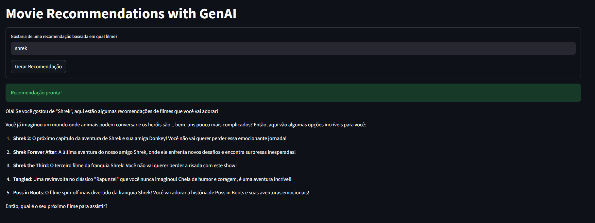

# 🎬 Vector-Based Movie Recommendations


Um motor de recomendação inteligente que utiliza **Processamento de Linguagem Natural (NLP)** e **Similaridade de Cosseno** em espaços vetoriais para sugerir filmes. Diferente de filtros comuns, este sistema entende o contexto semântico das sinopses para encontrar obras similares e utiliza **GenAI** para explicar o porquê da recomendação.

## 🚀 Funcionalidades

-   **Busca Semântica:** Utiliza `SentenceTransformers` para converter sinopses de filmes em vetores densos (embeddings).
-   **Cálculo de Similaridade:** Aplica a matemática da Similaridade de Cosseno para encontrar os vizinhos mais próximos no espaço vetorial.
-   **Integração com LLM (GenAI):** Conecta-se a modelos de linguagem (via Ollama ou Groq) para gerar respostas personalizadas e engajadoras sobre as recomendações.
-   **Interface Interativa:** Front-end construído em **Streamlit** para fácil visualização e interação.
-   **Otimização de Performance:** Uso de cache e pré-cálculo de vetores (`.pkl`) para respostas rápidas.

## 🛠️ Tech Stack

* **Linguagem:** Python
* **Interface:** Streamlit
* **Machine Learning:** SentenceTransformers (`all-MiniLM-L6-v2`), Scikit-Learn
* **GenAI / LLM:** LangChain, Ollama (Local) ou Groq (Cloud)
* **Manipulação de Dados:** Pandas, NumPy

## 🧠 Como Funciona

1.  **Vetorização:** O sistema carrega um dataset de filmes e converte as descrições textuais (`overview` + `keywords`) em vetores numéricos de alta dimensão.
2.  **Input do Usuário:** O usuário digita o nome de um filme que gosta.
3.  **Cálculo de Distância:** O algoritmo calcula a distância de cosseno entre o vetor do filme escolhido e todos os outros filmes do banco de dados.
4.  **Ranking:** Os filmes com os vetores mais próximos (menor ângulo) são selecionados.
5.  **Geração de Resposta:** O LLM recebe a lista de filmes recomendados e cria um texto natural explicando as sugestões.

## 📂 Estrutura do Projeto

```text
vector-movie-recs/
├── database/
│   ├── raw/                # Dados originais
│   └── processed/          # Dados limpos e embeddings (.pkl)
├── src/
│   ├── app.py              # Aplicação principal Streamlit
│   └── utils.py            # Funções auxiliares
├── requirements.txt        # Dependências do projeto
└── README.md
```

## ⚙️ Instalação e Uso Local (Por enquanto)

1. Clone o repositório

```
git clone [https://github.com/seu-usuario/vector-based-movie-recommendations.git](https://github.com/seu-usuario/vector-based-movie-recommendations.git)
cd vector-based-movie-recommendations
```

2. Crie um ambiente virtual (Recomendado)

```
python -m venv venv 
venv\Scripts\activate # Windows
source venv/bin/activate # Linux/Mac
```

3. Instale as dependências

```
pip install -r requirements.txt
```

4. Configuração do Modelo
- Rodando Localmente com Ollama Certifique-se de ter o Ollama instalado e rodando:

```
ollama serve
ollama pull llama3.2
```

5. Execute a aplicação

```
streamlit run app.py
```

## 🤝 Contribuição

Contribuições são bem-vindas! Sinta-se à vontade para abrir issues ou pull requests para melhorar o algoritmo de recomendação ou a interface.

## Implementações futuras!

- O projeto atualmente carrega o modelo na RAM, irei refatorar o código e aplicar vector-database, provavelmente o ChromaDB

## Resultados :)

